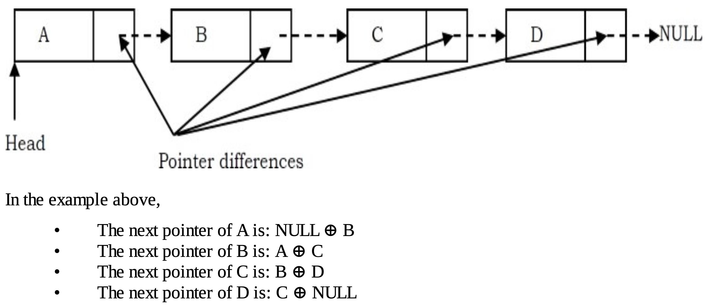
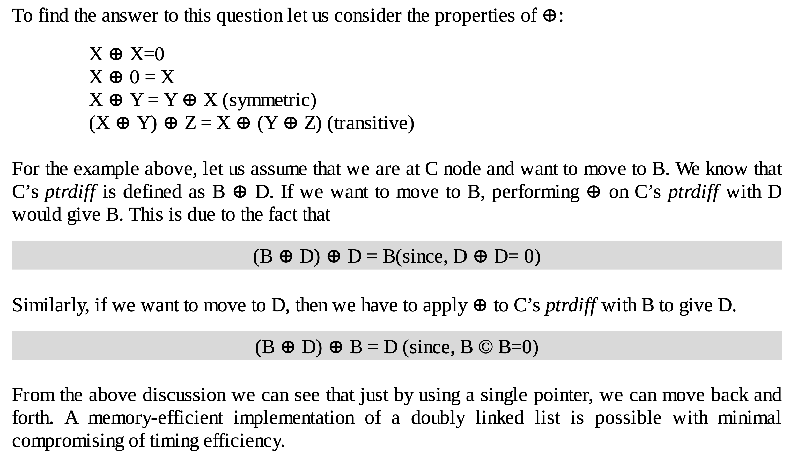
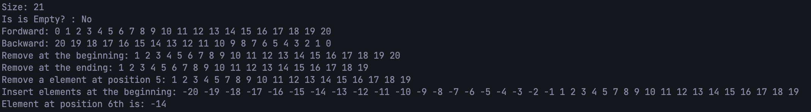

# A Memory-Efficient Doubly Linked List

This is an implementation of a doubly linked list using a memory-efficient approach.

# Why is it memory-efficient?

- In a conventional implementation, each node stores a pointer to the next item and a pointer to the previous item.
This means every node in a typical doubly linked list contains:
  - The data
  - A pointer to the next node
  - A pointer to the previous node
- In a memory-efficient implementation, we only store the XOR of the previous and next pointers, using the bitwise exclusive OR (⊕) operation.
With this approach, we can still traverse the list in both directions using just one pointer field per node.



# Why does it work?



# APIs

## Iterators:
| getForwardIterator | Get the forward iterator |
|---| --- |
| getBackwardIterator | Get the backward iterator |

## Modifiers:

| push_back | Insert element at the end of the list |
|---| --- |
| push_front | Insert element at the beginning of the list |
| pop_back | Remove element from the end of the list |
| pop_front | Remove element from the beginning of the list |
| insert | Insert an element at the specified index |
| remove | Remove an element at the specified index |

## Element access:
| get | Get the element at the specified index|
|---| --- |

## Capacity:
| getSize | Get the size of list |
|---| --- |
| isEmpty | Check wether list is empty or not | 

# How to traverse the list ?

I use iterator pattern to traverse elements of a collection without exposing its underlying representation

```c++
#include "memory-efficient-doubly-linkedlist.cpp"

int main(){
    MemoryEfficientLinkedList<int> list;
    list.push_back(1);
    list.push_back(2);
    list.push_back(3);
    MemoryEfficientLinkedList<int>::BaseIterator it = list.getBackwardIterator();
    while(it.hasNext()){
        cout<<it.getValue()<<" ";
        it.next();
    }
    return 0;
}
```
# Play ground
```c++
#include "memory-efficient-doubly-linkedlist.cpp"


void display(MemoryEfficientLinkedList<int> &list, bool isReverse = false ){
    MemoryEfficientLinkedList<int>::BaseIterator it = isReverse ? list.getBackwardIterator() : list.getForwardIterator();
    while(it.hasNext()){
        cout<<it.getValue()<<" ";
        it.next();
    }
    cout<<endl;
}

int main(){
    MemoryEfficientLinkedList<int> list;

    // insert elements at the ending
    for(int i = 0; i <= 20; i++){
        list.push_back(i);
    }

    cout<<"Size: "<<list.getSize()<<endl;
    cout<<"Is is Empty? : "<<(list.isEmpty() ? "Yes" : "No")<<endl;
    // display list
    cout<<"Fordward: ";
    display(list);
    cout<<"Backward: ";
    display(list, true);

    // remove at the beginning
    cout<<"Remove at the beginning: ";
    list.pop_front();
    display(list); 

    // remove at the beginning
    cout<<"Remove at the ending: ";
    list.pop_back();
    display(list);

    // remove a element at position 5
    cout<<"Remove a element at position 5: ";
    list.remove(5);
    display(list); 

    // insert elements at the beginning
    for(int i = -1; i >= -20; i--){
        list.push_front(i);
    }
    cout<<"Insert elements at the beginning: ";
    display(list); 

    // get a element at 6 position
    cout<<"Element at position 6th is: "<<list.get(6)<<endl;
    return 0;
}
```



{
  "sha": "801201e6423f141b21f1756338882ff830554582",
  "node_id": "B_kwDOPCnzFtoAKDgwMTIwMWU2NDIzZjE0MWIyMWYxNzU2MzM4ODgyZmY4MzA1NTQ1ODI",
  "size": 3387,
  "url": "https://api.github.com/repos/TechBlogSharing/TechBlog_DB/git/blobs/801201e6423f141b21f1756338882ff830554582",
  "content": "IyBBIE1lbW9yeS1FZmZpY2llbnQgRG91Ymx5IExpbmtlZCBMaXN0CgpUaGlz\nIGlzIGFuIGltcGxlbWVudGF0aW9uIG9mIGEgZG91Ymx5IGxpbmtlZCBsaXN0\nIHVzaW5nIGEgbWVtb3J5LWVmZmljaWVudCBhcHByb2FjaC4KCiMgV2h5IGlz\nIGl0IG1lbW9yeS1lZmZpY2llbnQ/CgotIEluIGEgY29udmVudGlvbmFsIGlt\ncGxlbWVudGF0aW9uLCBlYWNoIG5vZGUgc3RvcmVzIGEgcG9pbnRlciB0byB0\naGUgbmV4dCBpdGVtIGFuZCBhIHBvaW50ZXIgdG8gdGhlIHByZXZpb3VzIGl0\nZW0uClRoaXMgbWVhbnMgZXZlcnkgbm9kZSBpbiBhIHR5cGljYWwgZG91Ymx5\nIGxpbmtlZCBsaXN0IGNvbnRhaW5zOgogIC0gVGhlIGRhdGEKICAtIEEgcG9p\nbnRlciB0byB0aGUgbmV4dCBub2RlCiAgLSBBIHBvaW50ZXIgdG8gdGhlIHBy\nZXZpb3VzIG5vZGUKLSBJbiBhIG1lbW9yeS1lZmZpY2llbnQgaW1wbGVtZW50\nYXRpb24sIHdlIG9ubHkgc3RvcmUgdGhlIFhPUiBvZiB0aGUgcHJldmlvdXMg\nYW5kIG5leHQgcG9pbnRlcnMsIHVzaW5nIHRoZSBiaXR3aXNlIGV4Y2x1c2l2\nZSBPUiAo4oqVKSBvcGVyYXRpb24uCldpdGggdGhpcyBhcHByb2FjaCwgd2Ug\nY2FuIHN0aWxsIHRyYXZlcnNlIHRoZSBsaXN0IGluIGJvdGggZGlyZWN0aW9u\ncyB1c2luZyBqdXN0IG9uZSBwb2ludGVyIGZpZWxkIHBlciBub2RlLgoKIVts\naXN0XShpbWFnZXMvbGlzdC5wbmcpCgojIFdoeSBkb2VzIGl0IHdvcms/Cgoh\nW3doeSBkb2VzIGl0IHdvcmsgP10oaW1hZ2VzL3dvcmsucG5nKQoKIyBBUElz\nCgojIyBJdGVyYXRvcnM6CnwgZ2V0Rm9yd2FyZEl0ZXJhdG9yIHwgR2V0IHRo\nZSBmb3J3YXJkIGl0ZXJhdG9yIHwKfC0tLXwgLS0tIHwKfCBnZXRCYWNrd2Fy\nZEl0ZXJhdG9yIHwgR2V0IHRoZSBiYWNrd2FyZCBpdGVyYXRvciB8CgojIyBN\nb2RpZmllcnM6Cgp8IHB1c2hfYmFjayB8IEluc2VydCBlbGVtZW50IGF0IHRo\nZSBlbmQgb2YgdGhlIGxpc3QgfAp8LS0tfCAtLS0gfAp8IHB1c2hfZnJvbnQg\nfCBJbnNlcnQgZWxlbWVudCBhdCB0aGUgYmVnaW5uaW5nIG9mIHRoZSBsaXN0\nIHwKfCBwb3BfYmFjayB8IFJlbW92ZSBlbGVtZW50IGZyb20gdGhlIGVuZCBv\nZiB0aGUgbGlzdCB8CnwgcG9wX2Zyb250IHwgUmVtb3ZlIGVsZW1lbnQgZnJv\nbSB0aGUgYmVnaW5uaW5nIG9mIHRoZSBsaXN0IHwKfCBpbnNlcnQgfCBJbnNl\ncnQgYW4gZWxlbWVudCBhdCB0aGUgc3BlY2lmaWVkIGluZGV4IHwKfCByZW1v\ndmUgfCBSZW1vdmUgYW4gZWxlbWVudCBhdCB0aGUgc3BlY2lmaWVkIGluZGV4\nIHwKCiMjIEVsZW1lbnQgYWNjZXNzOgp8IGdldCB8IEdldCB0aGUgZWxlbWVu\ndCBhdCB0aGUgc3BlY2lmaWVkIGluZGV4fAp8LS0tfCAtLS0gfAoKIyMgQ2Fw\nYWNpdHk6CnwgZ2V0U2l6ZSB8IEdldCB0aGUgc2l6ZSBvZiBsaXN0IHwKfC0t\nLXwgLS0tIHwKfCBpc0VtcHR5IHwgQ2hlY2sgd2V0aGVyIGxpc3QgaXMgZW1w\ndHkgb3Igbm90IHwgCgojIEhvdyB0byB0cmF2ZXJzZSB0aGUgbGlzdCA/CgpJ\nIHVzZSBpdGVyYXRvciBwYXR0ZXJuIHRvIHRyYXZlcnNlIGVsZW1lbnRzIG9m\nIGEgY29sbGVjdGlvbiB3aXRob3V0IGV4cG9zaW5nIGl0cyB1bmRlcmx5aW5n\nIHJlcHJlc2VudGF0aW9uCgpgYGBjKysKI2luY2x1ZGUgIm1lbW9yeS1lZmZp\nY2llbnQtZG91Ymx5LWxpbmtlZGxpc3QuY3BwIgoKaW50IG1haW4oKXsKICAg\nIE1lbW9yeUVmZmljaWVudExpbmtlZExpc3Q8aW50PiBsaXN0OwogICAgbGlz\ndC5wdXNoX2JhY2soMSk7CiAgICBsaXN0LnB1c2hfYmFjaygyKTsKICAgIGxp\nc3QucHVzaF9iYWNrKDMpOwogICAgTWVtb3J5RWZmaWNpZW50TGlua2VkTGlz\ndDxpbnQ+OjpCYXNlSXRlcmF0b3IgaXQgPSBsaXN0LmdldEJhY2t3YXJkSXRl\ncmF0b3IoKTsKICAgIHdoaWxlKGl0Lmhhc05leHQoKSl7CiAgICAgICAgY291\ndDw8aXQuZ2V0VmFsdWUoKTw8IiAiOwogICAgICAgIGl0Lm5leHQoKTsKICAg\nIH0KICAgIHJldHVybiAwOwp9CmBgYAojIFBsYXkgZ3JvdW5kCmBgYGMrKwoj\naW5jbHVkZSAibWVtb3J5LWVmZmljaWVudC1kb3VibHktbGlua2VkbGlzdC5j\ncHAiCgoKdm9pZCBkaXNwbGF5KE1lbW9yeUVmZmljaWVudExpbmtlZExpc3Q8\naW50PiAmbGlzdCwgYm9vbCBpc1JldmVyc2UgPSBmYWxzZSApewogICAgTWVt\nb3J5RWZmaWNpZW50TGlua2VkTGlzdDxpbnQ+OjpCYXNlSXRlcmF0b3IgaXQg\nPSBpc1JldmVyc2UgPyBsaXN0LmdldEJhY2t3YXJkSXRlcmF0b3IoKSA6IGxp\nc3QuZ2V0Rm9yd2FyZEl0ZXJhdG9yKCk7CiAgICB3aGlsZShpdC5oYXNOZXh0\nKCkpewogICAgICAgIGNvdXQ8PGl0LmdldFZhbHVlKCk8PCIgIjsKICAgICAg\nICBpdC5uZXh0KCk7CiAgICB9CiAgICBjb3V0PDxlbmRsOwp9CgppbnQgbWFp\nbigpewogICAgTWVtb3J5RWZmaWNpZW50TGlua2VkTGlzdDxpbnQ+IGxpc3Q7\nCgogICAgLy8gaW5zZXJ0IGVsZW1lbnRzIGF0IHRoZSBlbmRpbmcKICAgIGZv\ncihpbnQgaSA9IDA7IGkgPD0gMjA7IGkrKyl7CiAgICAgICAgbGlzdC5wdXNo\nX2JhY2soaSk7CiAgICB9CgogICAgY291dDw8IlNpemU6ICI8PGxpc3QuZ2V0\nU2l6ZSgpPDxlbmRsOwogICAgY291dDw8IklzIGlzIEVtcHR5PyA6ICI8PChs\naXN0LmlzRW1wdHkoKSA/ICJZZXMiIDogIk5vIik8PGVuZGw7CiAgICAvLyBk\naXNwbGF5IGxpc3QKICAgIGNvdXQ8PCJGb3Jkd2FyZDogIjsKICAgIGRpc3Bs\nYXkobGlzdCk7CiAgICBjb3V0PDwiQmFja3dhcmQ6ICI7CiAgICBkaXNwbGF5\nKGxpc3QsIHRydWUpOwoKICAgIC8vIHJlbW92ZSBhdCB0aGUgYmVnaW5uaW5n\nCiAgICBjb3V0PDwiUmVtb3ZlIGF0IHRoZSBiZWdpbm5pbmc6ICI7CiAgICBs\naXN0LnBvcF9mcm9udCgpOwogICAgZGlzcGxheShsaXN0KTsgCgogICAgLy8g\ncmVtb3ZlIGF0IHRoZSBiZWdpbm5pbmcKICAgIGNvdXQ8PCJSZW1vdmUgYXQg\ndGhlIGVuZGluZzogIjsKICAgIGxpc3QucG9wX2JhY2soKTsKICAgIGRpc3Bs\nYXkobGlzdCk7CgogICAgLy8gcmVtb3ZlIGEgZWxlbWVudCBhdCBwb3NpdGlv\nbiA1CiAgICBjb3V0PDwiUmVtb3ZlIGEgZWxlbWVudCBhdCBwb3NpdGlvbiA1\nOiAiOwogICAgbGlzdC5yZW1vdmUoNSk7CiAgICBkaXNwbGF5KGxpc3QpOyAK\nCiAgICAvLyBpbnNlcnQgZWxlbWVudHMgYXQgdGhlIGJlZ2lubmluZwogICAg\nZm9yKGludCBpID0gLTE7IGkgPj0gLTIwOyBpLS0pewogICAgICAgIGxpc3Qu\ncHVzaF9mcm9udChpKTsKICAgIH0KICAgIGNvdXQ8PCJJbnNlcnQgZWxlbWVu\ndHMgYXQgdGhlIGJlZ2lubmluZzogIjsKICAgIGRpc3BsYXkobGlzdCk7IAoK\nICAgIC8vIGdldCBhIGVsZW1lbnQgYXQgNiBwb3NpdGlvbgogICAgY291dDw8\nIkVsZW1lbnQgYXQgcG9zaXRpb24gNnRoIGlzOiAiPDxsaXN0LmdldCg2KTw8\nZW5kbDsKICAgIHJldHVybiAwOwp9CmBgYAohW3Jlc3VsdCBkZW1vXShpbWFn\nZXMvZGVtby5wbmcp\n",
  "encoding": "base64"
}